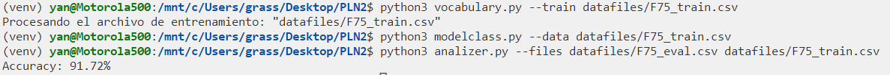
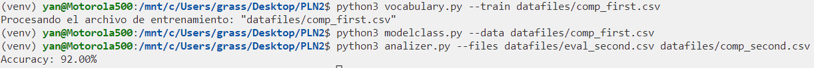

# PLN - Entrega 3

En la estructura de directoriorios encontramos 3 archivos ejecutables:

- **analizer.py**
- **modelclass.py**
- **vocabulary.py**

# **Files** 
- ## **Vocabulary.py**

  Este archivo contiene las funciones correspondientes al preprocesado de la informacion para generar un vocabulario y ademas tambien se ha decidido poner la funcion que preprocesa los tokens de los modelos de lenguaje. En el preprocesado incluimos las tecnicas de eliminación de números, puntuación, emojis, hasthags y repeticiones. Por otro lado, también se aplican las de tokenización, lematización.
  Se consideró quitar stopwords y truncar las palabras pero en la práctica se observó que era contraproducente.

  ### **Uso**

  ```bash
    python3 vocabulary.py --train \<nombre del archivo>
  ```
  ### **Output**

  \\_ vocabulario.txt

- ## **modelclass.py**

  Este archivo contiene las funciones para generar los modelos de lenguaje postivo, negativo y neutro. Por defecto utiliza el vocabulario generado por vocabulary.py y el fichero que utiliza para crear los modelos es: "./datafiles/F75_train.csv".

  ### **Uso**

  ```bash
    python3 modelclass.py --data \<nombre del archivo>
  ```
  ### **Output**
  **/corpus**<br>
    \\_ Corpus_N.txt <br>
    \\_ Corpus_P.txt <br>
    \\_ Corpus_T.txt <br>
    <br>

  **/langmod**<br>
    \\_ modelo_lenguaje_N.txt <br>
    \\_ modelo_lenguaje_P.txt <br>
    \\_ modelo_lenguaje_T.txt <br>

- ## **analizer.py**

  Genera a partir de un fichero de evaluación, un fichero en el que se clasificará linea por linea el sentimiento y su probabilidad en cada modelo.
  
  ### **Uso**

  Se puede utilizar de 2 formas el programa:
  
   _De la siguiente manera podremos generar una clasificación, con su respectivo resumen y comparar lo obtenido el resumen con un archivo de referencia.<br> ( El segundo fichero deberá ser como los empleados para entrenar los modelos de lenguaje ya que se obtiene del final de cada linea si el articulo es positivo, negativo o neutro. )_
  - python3 analizer.py --files datafiles/F75_eval.csv datafiles/F75_train.csv <br><br>

  _De la siguiente manera se genera la clasificación y su resumen_
   - python3 analizer.py --files datafiles/F75_eval.csv
   <br><br><br>

  ### **Output**
    **/results** <br>
    \\_ clasificacion_alu0101349480.txt <br>
    \\_ resumen_alu0101349480.txt <br>
    \\_ resumen_train.txt <br>

    _( resumen_train.txt es el resumen obtenido al pasar por segundo argumento un archivo con el que comparar el resumen obtenido de la clasificación. )_

# **Conclusiones y Estimación de Errores**

Para que se puedan replicar los ejercicios propuestos, dejaré las lineas de código empleadas para realizar las comprobaciones:

**1.** Probar el programa con F75_train.csv quitando la clase y estimar el error de clasificación. En la terminal: <br>
```bash
  python3 vocabulary.py --train datafiles/F75_train.csv
  python3 modelclass.py --data datafiles/F75_train.csv 
  python3 analizer.py --files datafiles/F75_eval.csv datafiles/F75_train.csv
  Accuracy: 91.72%
```
  

-----------------------

**2.** Dividir F75_train.csv en dos ficheros: F75_train_1.csv con las primeras 2000 noticias y F75_train_2.csv con las 500 últimas. Entrenar el sistema con el primer fichero y estimar el porcentaje de error con el segundo. En la terminal:<br>
```bash
  python3 vocabulary.py --train datafiles/comp_first.csv 
  python3 modelclass.py --data datafiles/comp_first.csv 
  python3 analizer.py --files datafiles/eval_second.csv datafiles/comp_second.csv 
  Accuracy: 92.00%
```
  


